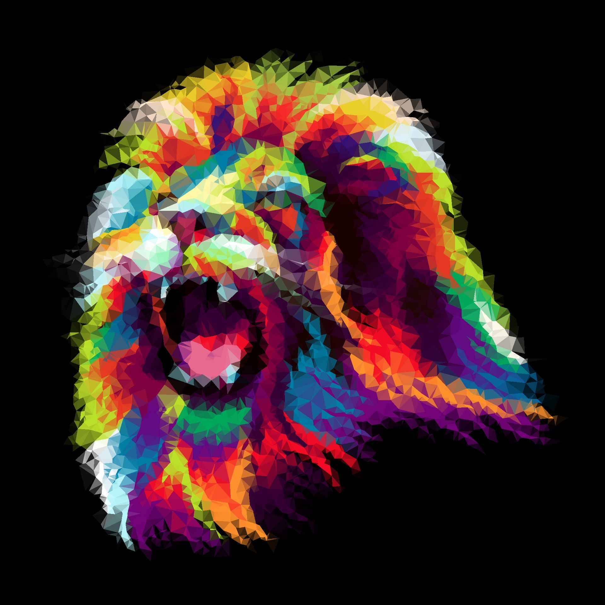

# Low Poly Converter
Convert your images and gifs (WIP) into low poly variants! Allows resizing and tweaking the intensity of the poly-fication.

#### Supports:
- jpg/jpeg
- png
- gif [WIP]

The resulting output will be saved to `[input_file_path]-low-poly.[format]`

## Usage
```bash
# Resize the image
./low-poly -resize 800x1200 ./pictures/gopher.png

# Change the intensity to 75%
./low-poly -intensity 75 ./pictures/gopher.png

# Why not both?
./low-poly -resize 640x640 -intensity 50 ./pictures/why-not-both.jpg

# Or none at all
./low-poly ./pictures/gopher.png
```

## Examples

 